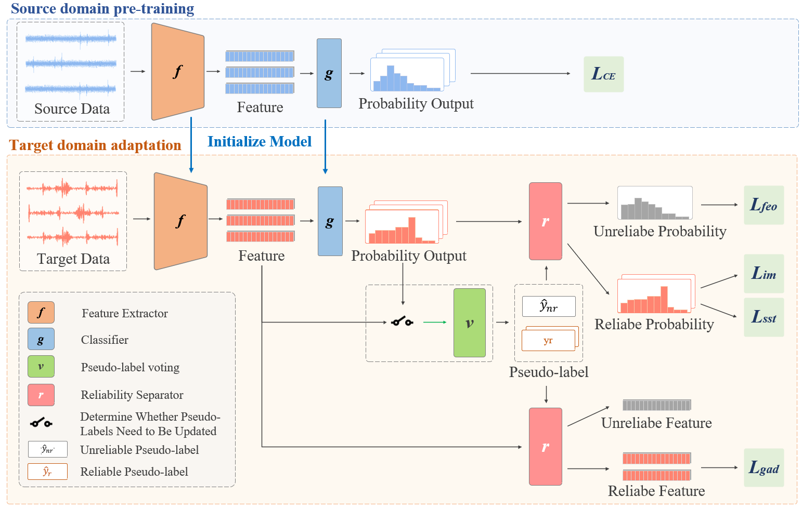

# Official implementation for **SDALR**

## [**Source-free domain adaptation based on label reliability for cross-domain bearing fault diagnosis**](http://www.baidu.com)


### Framework:  



### Prerequisites:
- python == 3.11.10
- pytorch ==2.4.1
- numpy, scipy, sklearn, PIL, argparse, tqdm, openpyxl, collections

### Dataset:

-  Please manually download the datasets [PU](https://pan.baidu.com/s/1d505GjqsmHWlwFG5hb5c3Q?pwd=5m1l), [JNU](https://pan.baidu.com/s/1d505GjqsmHWlwFG5hb5c3Q?pwd=5m1l),
  
-  Concerning the dsatasets, put it into './DATA/'.


### Training:
1. ##### Source-free Domain Adaptation (SFDA) on the dataset PU
	- Train model on the source domains, respectively
	```python
	 cd object/
	 python src_pretrain_RES_PU.py
	```
	
	- Adaptation to the target domain
	```python
	./choose_s_t_PU.sh
	```
	
2. ##### Source-free Domain Adaptation (SFDA) on the dataset JNU
	- Train model on the source domains, respectively
	```python
	 cd object/
	 python src_pretrain_RES_JNU.py
	```
	
	- Adaptation to the target domain
	```python
	 ./choose_s_t_JNU.sh
   	 ```

### Contact

- [bd_lab@163.com](mailto:bd_lab@163.com)
