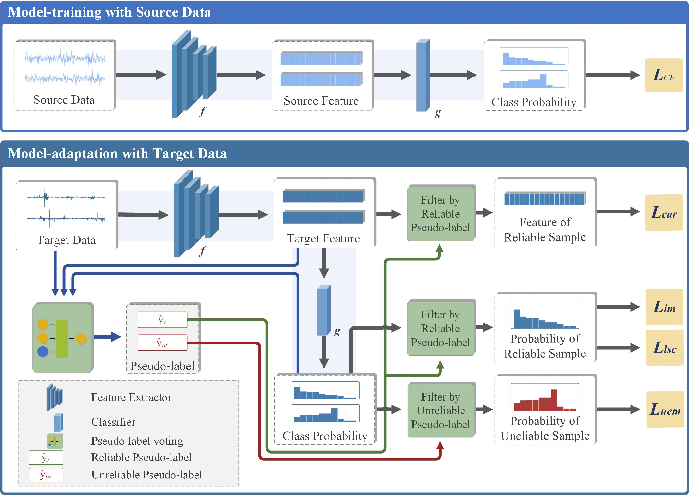

# Official implementation for **SDALR**

## [**Source-free domain adaptation based on label reliability for cross-domain bearing fault diagnosis**](http://www.baidu.com)


### Framework:  



### Prerequisites:
- python == 3.6.8
- pytorch ==1.1.0
- torchvision == 0.3.0
- numpy, scipy, sklearn, PIL, argparse, tqdm

### Dataset:

-  Please manually download the datasets [PU](https://pan.baidu.com/s/1d505GjqsmHWlwFG5hb5c3Q?pwd=5m1l), [JNU](https://pan.baidu.com/s/1d505GjqsmHWlwFG5hb5c3Q?pwd=5m1l),
  
-  Concerning the dsatasets, put it into './digit/data/'.


### Training:
1. ##### Source-free Domain Adaptation (SFDA) on the dataset PU
	- MNIST -> USPS (**m2u**)   SHOT (**cls_par = 0.1**) and SHOT-IM (**cls_par = 0.0**)
	```python
	 cd digit/
	 python uda_digit.py --dset m2u --gpu_id 0 --output ckps_digits --cls_par 0.0
	 python uda_digit.py --dset m2u --gpu_id 0 --output ckps_digits --cls_par 0.1
	```
	
2. ##### Source-free Domain Adaptation (SFDA) on the dataset JNU
	- Train model on the source domain **A** (**s = 0**)
    ```python
    cd object/
    python image_source.py --trte val --da uda --output ckps/source/ --gpu_id 0 --dset office --max_epoch 100 --s 0
    ```
	
	- Adaptation to other target domains **D and W**, respectively
    ```python
    python image_target.py --cls_par 0.3 --da uda --output_src ckps/source/ --output ckps/target/ --gpu_id 0 --dset office --s 0  
    ```
   
3. ##### Unsupervised Closed-set Domain Adaptation (UDA) on the VisDA-C dataset
	- Synthetic-to-real 
    ```python
    cd object/
	 python image_source.py --trte val --output ckps/source/ --da uda --gpu_id 0 --dset VISDA-C --net resnet101 --lr 1e-3 --max_epoch 10 --s 0
	 python image_target.py --cls_par 0.3 --da uda --dset VISDA-C --gpu_id 0 --s 0 --output_src ckps/source/ --output ckps/target/ --net resnet101 --lr 1e-3
	 ```
	
	
6. ##### Unsupervised Multi-source Domain Adaptation (MSDA) on the Office-Caltech dataset
	- Train model on the source domains **A** (**s = 0**), **C** (**s = 1**), **D** (**s = 2**), respectively
	```python
	 cd object/
	 python image_source.py --trte val --da uda --output ckps/source/ --gpu_id 0 --dset office-caltech --max_epoch 100 --s 0
	 python image_source.py --trte val --da uda --output ckps/source/ --gpu_id 0 --dset office-caltech --max_epoch 100 --s 1
	 python image_source.py --trte val --da uda --output ckps/source/ --gpu_id 0 --dset office-caltech --max_epoch 100 --s 2
	```
	
	- Adaptation to the target domain **W** (**t = 3**)
	```python
	 python image_target.py --cls_par 0.3 --da uda --output_src ckps/source/ --output ckps/target/ --gpu_id 0 --dset office --s 0
	 python image_target.py --cls_par 0.3 --da uda --output_src ckps/source/ --output ckps/target/ --gpu_id 0 --dset office --s 1
	 python image_target.py --cls_par 0.3 --da uda --output_src ckps/source/ --output ckps/target/ --gpu_id 0 --dset office --s 2
	 python image_multisource.py --cls_par 0.0 --da uda --dset office-caltech --gpu_id 0 --t 3 --output_src ckps/source/ --output ckps/target/
	```

**Please refer *./object/run.sh*** for all the settings for different methods and scenarios.

### Contact

- [bd_lab@163.com](mailto:bd_lab@163.com)
